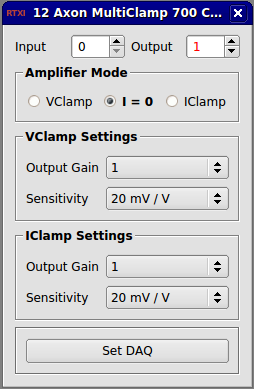

###Axon Multiclamp 700 Controller

**Requirements:** None  
**Limitations:** None  

<!--start-->
Amplifier control module to compensate for scaling properties of the Axon Multiclamp 700 controller. This module essentially acts as an interface that augments the system control panel. Rather than manually set the gains on each channel, you can use this module to set them with a few button clicks instead.   
<!--end-->

**Note:** You still need to open the system control panel to activate channels. This module won't do it for you.  

####Input Channels
None  

####Output Channels  
1. output(0) - Mode Output : Control signal returned to amplifier

####Parameters
1. Acquisition Mode - Amplifier mode setting (vclamp, iclamp, or i=0)
1. Input Channel - Input channel to scale (#)
2. Output Channel - Output channel to scale (#)
3. VClamp Gain - Headstage configuration gain for vclamp mode
4. IClamp Gain - Headstage configuration gain for iclamp mode
5. VClamp Sensitivity - Command sensitivity for vclamp (mV/V)
6. IClamp Sensitivity - Command sensitivity for iclamp (pA/V)

####States
None
