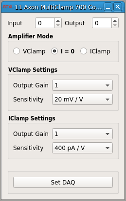

###Axon Multiclamp 700 Controller

**Requirements:** None  
**Limitations:** None  

<!--start-->
Amplifier control module to compensate for scaling properties of the Axon Multiclamp 700 controller. This module essentially acts as an interface that replicated functionality of the control panel, but in a manner specific to the controller's own functionality. 
<!--end-->

####Input Channels
1. input(0) - Gain Telegraph : the telegraph used in Auto mode

####Output Channels  
1. output(0) - Mode Output

####Parameters
1. Input Channel
2. Output Channel 
3. VClamp Gain
4. IClamp Gain
5. VClamp Sensitivity
6. IClamp Sensitivity

####States
None
